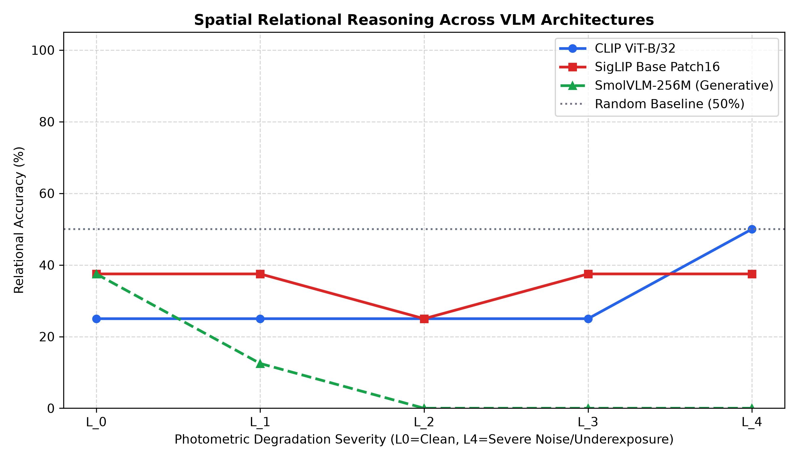

## Empirical Findings: Multi-Architecture Benchmark

Evaluation across dual-encoders (InfoNCE vs. Sigmoid loss) and an autoregressive decoder-only vision-language model:

| Severity Level | Attenuation / Noise Details | CLIP ViT-B/32 (%) | SigLIP Base Patch16 (%) | SmolVLM-256M (%) |
| :--- | :--- | :--- | :--- | :--- |
| **$L_0$** | Clean Baseline | 25.0% | 37.5% | 37.5% |
| **$L_1$** | Mild Attenuation ($\gamma=1.5, \sigma=5$) | 25.0% | 37.5% | 12.5% |
| **$L_2$** | Moderate Starvation ($\gamma=2.2, \sigma=15$) | 25.0% | 25.0% | 0.0% |
| **$L_3$** | Severe Starvation ($\gamma=3.0, \sigma=30$) | 25.0% | 37.5% | 0.0% |
| **$L_4$** | Extreme Low-Light ($\gamma=4.2, \sigma=60$) | 50.0% | 37.5% | 0.0% |

### Key Takeaways
1. **Architecture-Agnostic Syntactic Blindness:** Swapping InfoNCE softmax for SigLIP's pairwise sigmoid loss or SmolVLM's autoregressive cross-attention does not solve relational blindness. All evaluated models operate below random guessing (50%) at baseline ($L_0$).
2. **Divergent Perception Collapse Dynamics:**
   * **Dual Encoders (CLIP, SigLIP):** Degrade into random chance ($37.5\% - 50.0\%$) as image-text embedding vectors collapse toward zero margin.
   * **Autoregressive VLM (SmolVLM):** Exhibits catastrophic degradation collapse down to **0.0%** at $L_2-L_4$. When visual patch tokens become corrupted, generation collapses into repetitive negative priors.

